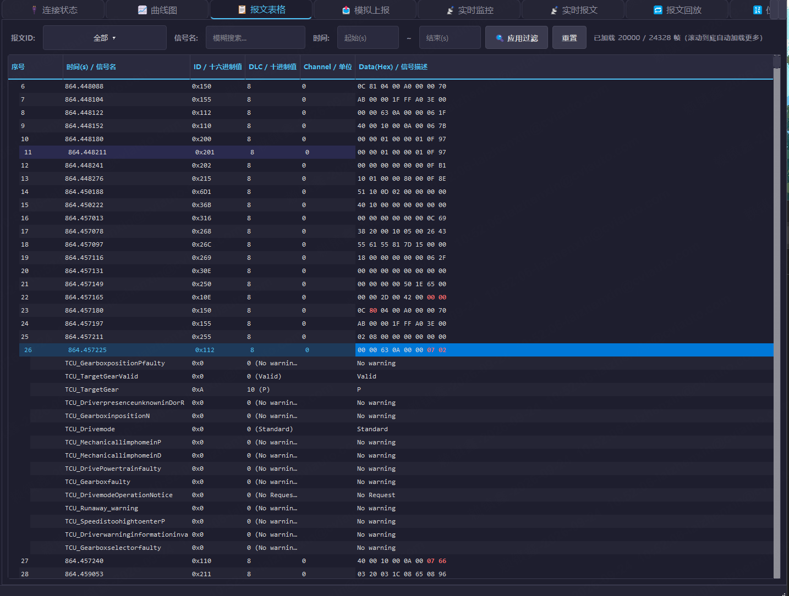
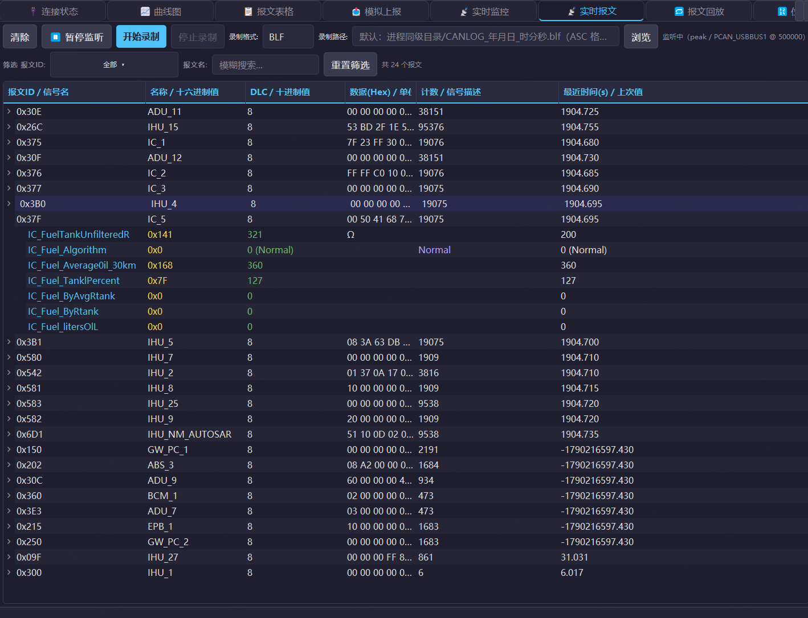
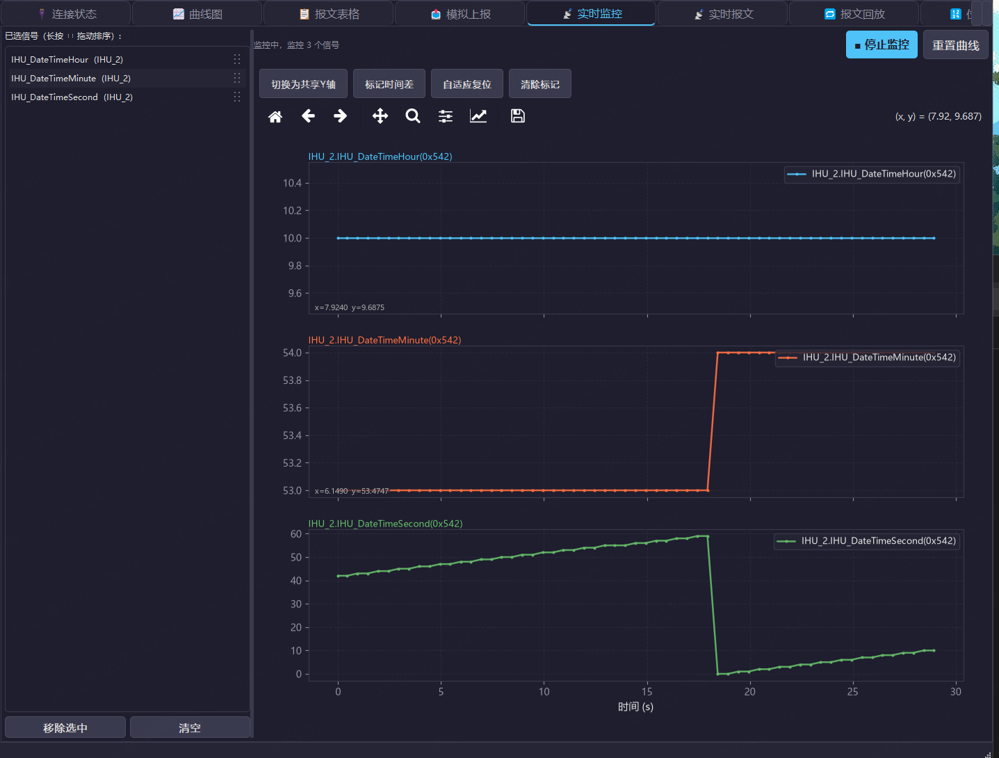
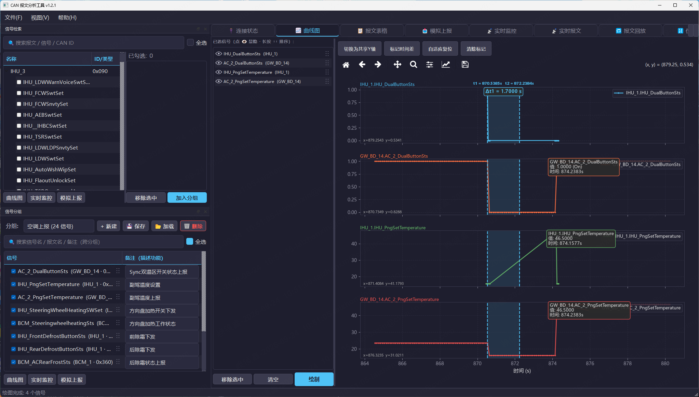
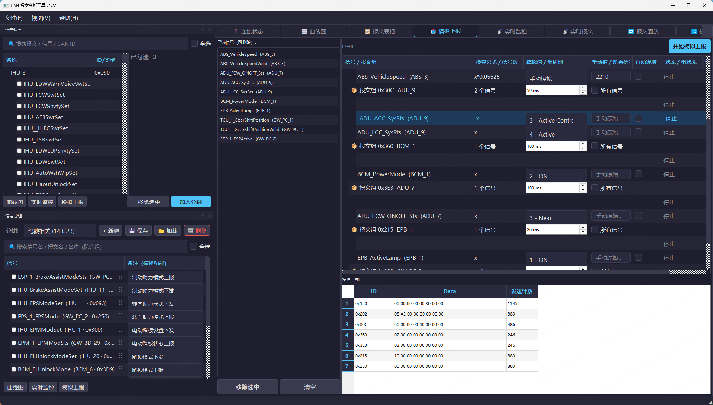

# CAN 报文分析工具 (CanMsgParser) v1.3.0

基于 PyQt5 的 CAN 报文分析桌面工具，支持 DBC 解析、信号检索与分组、曲线绘制、
实时监控、信号模拟上报、报文回放与录制（BLF / ASC）等功能。

## 版本说明

- **v1.3.0**：曲线图交互与性能专项优化。
  **性能**：曲线图悬停提示、时间差标记拖动的响应耗时大幅下降（悬停约 236ms → 38ms、
  标记线拖动约 207ms → 20ms、标记预览约 174ms → 5ms），做法是把「每次鼠标移动都整图重绘」
  改为 **blit 局部刷新**（背景位图缓存 + 仅重绘变化元素），并为文本尺寸、曲线像素、
  降采样结果建立三级缓存；实时监控曲线的写入与刷新解耦，改由定时器约 30FPS 合并刷新
  （原先每来一帧就整图重绘）；LTTB 降采样改为向量化实现（50 万点约快 3 倍，输出逐位一致）
  并加缓存。
  **交互**：① **左键直接拖动平移**（拖动过程实时跟手，原先按下～松开只平移一次、无动态反馈），
  并以 4 像素位移阈值区分「单击」与「拖动」；② 新增 **Ctrl+滚轮以鼠标位置为中心缩放**
  （不按 Ctrl 时保持原有滚轮行为）；③ 点击曲线弹出的数值说明框现按「不压曲线、不出界」
  优先自动避让，每条曲线最多同时显示 **3 个**，**右键说明框可关闭**；④ 修复曲线图
  重绘后固定提示窗残留、信号名映射表逐轮膨胀（悬垂引用）导致的固定高亮静默失效。
  **悬停交互修复（同日补充）**：① 鼠标微动时提示窗**不停闪烁**（坐标文本与提示窗各自
  局部刷新、互相擦除 → 合并为同一次刷新，且命中点未变时整帧跳过）；② 鼠标离开曲线后
  曲线上残留**小箭头**（文本置空后 matplotlib 仍绘制箭头 → 改为整体隐藏）；③ 沿曲线
  滑动时**第一个提示窗永不消失**（捕获背景位图前未隐藏临时图层，被烙进背景后每次局部
  刷新都贴回）；④ 点击钉住的点与悬停窗显示的**不是同一个点**（两处选点规则不一致 →
  统一为同一套归一化最近点度量）；⑤ 同一个点会**叠出多个**提示窗；⑥ 有固定窗的曲线
  其它数据点**无法再悬停**（整条屏蔽改为**按点去重**）；⑦ 工具栏新增 **「清除提示窗」**，
  一键清空全部固定提示窗并复原曲线线宽。
- **v1.2.1**：新增 **ASC(.asc) 日志加载与录制支持**（自带 ASC 解析器，取代 python-can
  的 `ASCReader`，修复加载 `.asc` 报 `telling position disabled by next() call` 直接失败、
  以及其吞掉文件首帧导致的时间原点右移；实时报文页工具栏新增「录制格式」下拉，可选
  BLF / ASC）。详见下文「日志加载与录制格式（BLF / ASC）」。同时修复两处缺陷：
  ① **曲线图个别信号波形恒为 0**（同一帧在「实时报文」页能正常显示数值）——曲线图走的是
  向量化解码（非逐帧 `decode`），其「信号是否落在数据范围内」的越界判定误用了 DBC 原始
  起始位：Motorola(大端) 起始位是锯齿形编号（同一字节内 7=MSB → 0=LSB），其网络位起点为
  `8*(start//8) + (7 - start%8)`，不换算会把占用范围恰好贴合数据末尾的信号（如 64 字节
  CAN FD 报文里的 `503|16@0+`，实际用到第 64 字节末位）误判为越界、整条曲线静默置 0；
  现将位提取与越界判定统一到换算后的网络位起点，并补充按网络位起点穷举的边界回归测试。
  ② **曲线图数值说明框贴边看不全、被图例遮挡**——现按数据点相对位置自动翻转偏移，并用
  渲染器实测框体尺寸夹回绘图区内，同时提高其绘制层级使其不被图例覆盖。
- **v1.2.0**：报文筛选增强（报文表格页支持多报文 ID 同时筛选、筛选菜单顶部带 ID
  搜索框、修复点击复选框无法勾选，实时报文页新增筛选栏）、曲线图时间差标记增强
  （支持三组标记、自动捕捉 CAN 帧、标记线贯穿所有波形、组内同色 + 区间范围色带、
  Δt 提示框移入绘图区并可拖动实时刷新）。详见下文「报文筛选」「时间差标记」。
- **v1.1.1**：跨平台适配（macOS 可编译、中文字体按平台自动选择）、打包脚本
  按平台自动切换参数。详见「macOS 环境搭建与编译」。
- **v1.1.0**：信号分组与信号检索视图拆分独立、跨分组搜索与勾选框交互重构。

## 界面布局（停靠视图）

主窗口采用可浮动 / 可停靠的 `QDockWidget` 布局。与信号管理相关的两个视图已
**拆分为相互独立又互相联动**的视图，共用同一套深色主题（`widgets/theme.DARK_PANEL_QSS`），
保证视觉一致：

| 视图 | 停靠标题 | 作用 |
| --- | --- | --- |
| 信号分组 | **信号分组** | 管理多个信号分组（新建 / 删除 / 切换），编辑备注，将分组内信号分发出去 |
| 信号检索 | **信号检索** | 浏览 / 搜索 DBC 报文与信号，勾选后可分发到曲线图 / 实时监控 / 模拟上报，或「加入分组」 |

默认排布：两个视图**纵向堆叠**，**「信号检索」在上、「信号分组」在下**，
高度 1:1 均分。主窗口左侧有足够空间时浮出为同一列的两个悬浮窗，否则停靠回
左侧停靠区，两种情况下上下顺序一致。

> 浮动列宽取自面板的 `sizeHint / minimumSizeHint`，不再使用停靠态宽度
> （停靠时两窗被挤在左侧停靠区内，宽度远小于实际所需，会导致浮动后两窗重叠）。

两视图联动方式：
- 在「信号检索」视图勾选信号后点击 **加入分组**，信号即被加入「信号分组」视图的当前分组；
- 「信号分组」视图若无任何分组，会自动创建「默认分组」接收。

## 信号检索视图（信号检索）

- 顶部搜索框支持报文名 / CAN ID（十六进制，如 `1A0`）模糊搜索；
- 勾选信号使用与分组视图一致的单一 **全选** 勾选框（非按钮）：勾选即选中当前
  搜索结果中所有可见信号，取消即全不选；任一可见信号被取消勾选时，全选框自动
  变为未勾选状态；
- 「已勾选信号」列表跨搜索保留，可单独移除（Delete 键或「移除选中」）。

## 信号分组视图（信号分组）

- 分组内信号搜索为 **跨分组搜索**：按信号名 / 报文名 / 帧 ID / 备注匹配，命中信号按
  所属分组以「分组标题 + 子项」归类显示；
- 不再提供「移除选中」按钮，改用 **Delete 键** 移除选中信号；
- 「全选」单一勾选框（与信号检索视图一致）：勾选=全选当前可见信号，取消=全不选，
  任一可见信号取消勾选则全选框自动取消；
- **单次搜索勾选语义**：信号的勾选仅在当前一次搜索有效，重新搜索即恢复为不勾选状态；
- 「全选」勾选框位于**搜索框正下方**（紧邻搜索条件，便于搜索后立即批量勾选）；
- 备注列可编辑（描述信号功能），随分组配置 JSON 自动保存（2000ms 节流）。

## 模拟上报页

信号按 **CAN ID 聚合为「报文组」**：同一帧的多个信号填入同一帧一次性编码发送，
每组有独立的发送周期与「发送 / 停止」按钮。

- **「所有信号」勾选框**（位于报文组行的「手动值 / 所有信号」列）：
  - 勾选：展开该报文在 DBC 中的**全部信号**作为「补充行」（灰色显示），
    同样可修改模拟值 / 手动值 / 自动递增，并随整帧一起发送；
  - 取消：仅移除补充行，**用户已选信号及其已填模拟值原样保留**；
  - 无枚举可选的补充信号会预填手动值 `0`，避免发送时刷出大片「请填写手动值」；
  - 组内已无「用户已选」信号时整组销毁，不会留下只剩补充行的空壳组。
- 模拟值下拉框行高已调大（行高 40px / 控件 30px），修复选中后文字上下被裁切。

## 页签按钮宽度

主窗口顶部页签（`QTabWidget`）按钮的最小宽度已加大，确保四字 / 五字页签标签
（如「报文表格」「位图查看器」）完整显示、不再被裁切；页签总宽在最小窗口宽度
（1280px）内仍可容纳全部页签。

## 报文筛选（报文表格 / 实时报文）

两页的报文 ID 筛选统一为**多选**：点击筛选按钮弹出勾选列表，可同时勾选多个
报文 ID（勾选后菜单不关闭，可连续勾选多个）；首项「全部」为快捷项，勾选即清空
其它勾选（不做 ID 过滤），勾选任一具体 ID 会自动取消「全部」。按钮文字只给摘要
（`全部` / `0x1A0, 0x2C0` / `已选 3 个 ID`），完整列表见 tooltip，避免长文本把
按钮撑宽。

- 筛选菜单**顶部带搜索框**：ID 较多时输入片段即可即时过滤列表（`1A0` / `0x1A0`、
  大小写均可，`0x` 前缀可省略），只隐藏不重建，已勾选状态不受影响；命中唯一项时按
  回车直接勾选 / 取消勾选；无匹配时列表下方给出「无匹配的报文 ID」提示。每次展开
  菜单都会自动清空搜索词并聚焦输入框，不会残留上一次的过滤状态。
- 列表项**整行可点，复选框本身同样可点**：QListWidget 原生只在点中勾选框小方块时
  才切换状态，这里补了一次整行切换，不必精确瞄准小方块。判定「Qt 是否已自行切换」
  用的是**本次按下之前**记录的状态（由 `_CheckListWidget.mousePressEvent` 在调用
  super 之前读取）——点击复选框时 Qt 走 delegate 的 `editorEvent`、`pressed` 信号
  并不发出，若改用 `itemPressed` 回调记录，拿到的会是上一次交互的残留值，从而把
  刚勾上的又切回去。取消「全部」而其它项都未勾选时会自动恢复，不出现语义不明的
  「空筛选」。
- **报文表格页**：报文 ID 多选 + 信号名模糊搜索 + 时间区间。ID 勾选变化即时重新
  过滤（不必再点「应用过滤」）。
- **实时报文页**（v1.2.0 新增筛选栏）：报文 ID 多选 + 报文名模糊搜索（不区分
  大小写，也可用 `0x1A0` 形式匹配 ID）+「重置筛选」，右侧显示「显示 N / M 个报文」。
  不匹配的报文行**只是隐藏**——计数、最近时间、解码值仍在后台持续更新，取消筛选后
  立刻恢复完整数据，不会因筛选丢帧。实时页的 ID 候选随报文到达与 DBC 加载自动累积。

## 时间差标记（曲线图）

「标记时间差」用于比较时刻差值（尤其是不同信号之间的对应时刻），**最多可同时标
三组**，每组两根线界定一个时间区间：

- **自动捕捉**：落点自动吸附到**最近的 CAN 帧采样点**（在所有可见信号的采样时间中
  取最近的一个），X 轴放大后不必靠肉眼对齐到指定帧；鼠标移动时有白色点状预览线
  提示即将落在哪个采样点上。离最近采样点超过 12px 时不吸附（保留原始位置），
  避免 X 轴拉得很宽时被吸到很远的帧上。
- **贯穿所有波形**：标记线画在**每个子图**上，独立子图模式下同样纵贯整个绘图区，
  便于比较同一时刻不同信号的值、以及周期不同的报文。
- **同组同色、组间异色**：第 1/2/3 组依次用青 `#4fc3f7`、橙 `#ff7043`、紫 `#ab47bc`，
  组内两根线颜色一致，避免多组标记线互相混淆；每根线顶部各带时间标签
  （`t1 = 1.2340s`）。
- **范围标识（色带）**：每组两根线之间加一条同色半透明色带，标出该组的时间范围，
  一眼看出「这一组从哪到哪」；Δt 提示框显示在该色带之上，形如 `Δt1 = 0.1500 s`。
- **Δt 提示框在绘图区内**：提示框定位在绘图区内部顶部，并按组向下错开（三组互不
  叠压），层级高于所有曲线与网格——不会跑到绘图区外、也不会被上层子图压住。
  贴近左右边界时自动改为边缘对齐，避免框体出界。
- **可拖动 + Δt 实时刷新**：放置后按住标记线即可拖动（拖动时同样自动捕捉），竖线、
  顶部时间标签、所属组的色带与 Δt 文本一起实时更新；拖动标记线不会触发画布平移。
- **放满三组自动退出**标记模式；中途退出再进入可**接着标**（已放的标记保留）。
  右键或「清除标记」按钮清空。切换子图模式、显隐信号等触发重绘时，标记线会自动恢复。

## 日志加载与录制格式（BLF / ASC）

日志加载与实时录制均同时支持两种格式：

- **BLF**（Vector 二进制）：体积小、写入快，适合长时间 / 大数据量录制；
- **ASC**（CANoe ASCII 文本）：纯文本可读，便于用文本工具二次处理与人工查看，
  但同内容体积明显更大。

**加载**：主界面「打开日志」或直接把 `.blf` / `.asc` 拖入窗口；报文表格、曲线图、
信号检索均可分析。「报文回放」页可回放 `.blf` / `.asc` / `.log` / `.csv`。

**录制**：实时报文页工具栏的「录制格式」选择 BLF / ASC；录制路径留空时默认写入
进程同级目录 `CANLOG_年月日_时分秒.blf`（选 ASC 则为 `.asc`）。录制中可随时停止，
ASC 文件会正常补写结束标记（`End TriggerBlock`），可直接用 CANoe 或本工具打开。

**ASC 解析实现说明**：本项目使用自带 ASC 解析器，而非 python-can 的 `ASCReader`。
后者有两个问题：① 以文本模式打开文件，迭代后 `tell()` 被禁用，加载进度回调会抛
`OSError: telling position disabled by next() call`（GUI 加载 `.asc` 直接失败）；
② 其头部解析会消费并丢弃第一条数据行，导致文件首帧丢失（实测样例 133898 行只
解析出 133897 帧），同时把测量时间原点右移。自带解析器按二进制逐行读取
（`tell()` 始终可用）、单遍扫描，既不丢首帧也不影响进度显示。

支持的行类型：经典数据帧、远程帧、扩展帧（ID 后缀 `x`）、CAN FD 帧，`hex` / `dec`
两种进制；错误帧、注释、统计信息、J1939 等行自动跳过（不中断加载）。

## 日志时间轴（与市面工具对齐）

载入 BLF / ASC 后，所有时间均以**统一原点**表示，与 TSMaster / CANalyzer 等市面
工具约定一致，便于直接对照：

- **原点 = 测量开始时刻**：BLF 取文件头 `start_timestamp`（测量开始），ASC 等无该
  字段时回落到首帧时间；消息表与信号曲线的 X 轴均以此为 `t=0`。
- **所有信号共用同一时间原点**：信号解码后不再按「本信号首帧」二次归零。这样
  「下发信号」与「上报信号」的时间轴完全对齐，**反馈时长可直接用两信号时间相减
  得到**，不会因各自归零而错位。
- 示例：某信号首帧出现于测量开始后 19.247s、其值为 5 的首帧位于 41.646s，则
  信号曲线上该点即显示在 **41.646s**，与 TSMaster 读数一致。

## 依赖

```
PyQt5 matplotlib cantools python-can pandas numpy openpyxl xlrd lxml uptime
```

- 完整清单见 `requirements.txt`（其中 `pytest` 仅用于开发自测、`pyinstaller`
  仅用于打包，**运行时不需要**）。
- **Python 版本**：推荐 **3.11 / 3.12**。PyQt5 5.15.11（当前最新版）官方支持到
  Python 3.12，更高版本虽可能装上但属未验证组合，不建议用于打包。

## 运行

```bash
python main.py
```

## 打包

```bash
python build.py
```

`build.py` 会自动按当前平台选择参数，产物路径如下：

| 平台 | 产物 |
| --- | --- |
| Windows | `dist/CanMsgParser/CanMsgParser.exe`（无控制台窗口，onedir 模式） |
| macOS | `dist/CanMsgParser.app`（双击运行，或 `open dist/CanMsgParser.app`） |
| Linux | `dist/CanMsgParser/CanMsgParser` |

`build.py` 会将上一版 `dist/`、`build/`、`.spec` 改名移入 `.build_trash/`（已被
`.gitignore` 忽略），不再保留编译产物备份。

### Windows 安装包（Inno Setup）

`dist/CanMsgParser/` 本身已是自包含产物，可整个目录直接分发；若需要带开始菜单 /
桌面快捷方式与卸载入口的安装包，用 `installer/installer.iss`（Inno Setup 6）编译：

```bash
# 1) 先构建 dist（安装包只做「搬运 + 快捷方式 + 卸载入口」，不下载任何外部依赖）
python build.py

# 2) 再编译安装包（ISCC.exe 路径按本机安装位置调整）
"C:\Program Files (x86)\Inno Setup 6\ISCC.exe" installer\installer.iss
```

产物为 `installer/output/CanMsgParser_Setup_<版本>.exe`。

- `installer/installer.iss` 纳入版本管理；产物 `installer/output/CanMsgParser_Setup_<版本>.exe`
  与 `dist/` 一样**不入库**（`.gitignore` 已忽略），改由 GitHub Release 的附件下发。
- 版本号在 `installer.iss` 的 `MyAppVersion` 定义，需与 `main_window.py` 窗口标题 /
  关于对话框、`widgets/splash_screen.py`、本 README 标题**四处保持一致**。
- 用户级安装（`PrivilegesRequired=lowest` + `DefaultDirName={localappdata}`），全程
  无需管理员权限；`ArchitecturesAllowed=x64compatible` 与 x64 的 Python 3.14 构建一致。
- `AppId` 是卸载 / 升级识别的唯一标识，**发布后不要再改**，否则会被识别成两套程序。

> **跨平台说明**：原先字体只写了 Windows 字体，macOS 下曲线图中文会显示为方框
> （回落到不含中文字形的 DejaVu Sans）。现统一由 `utils/font_helper.py` 按平台
> 给出字体候选——Windows 用 Microsoft YaHei、macOS 用 PingFang SC、Linux 用
> Noto Sans CJK SC，三者互为兜底，`build.py` 的 Windows 专属参数
> （`--manifest` / `--noconsole`）也已在非 Windows 平台跳过。

## macOS 环境搭建与编译

> 适用：macOS 12+，Intel(x86_64) 与 Apple Silicon(arm64) 均可。

### 1. 确认架构与 Python 版本

```bash
uname -m            # arm64 = Apple Silicon；x86_64 = Intel
python3 --version
```

- 推荐 **Python 3.11 或 3.12**（PyQt5 5.15.11 官方支持到 3.12）。
- Apple Silicon 请务必使用**原生 arm64** Python。若 `uname -m` 输出 `arm64`
  而 Python 是 x86_64（Rosetta），PyQt5 与打包产物都会以转译模式运行，性能差
  且产物只能在该模式下启动。

用 pyenv 安装（推荐，便于锁定版本）：

```bash
brew install pyenv
pyenv install 3.12.6
pyenv local 3.12.6          # 在本项目目录下固定版本
```

也可直接用 Homebrew 的 Python：`brew install python@3.12`。

### 2. 创建虚拟环境并安装依赖

```bash
cd CanMsgParser
python3 -m venv .venv
source .venv/bin/activate
python -m pip install --upgrade pip
pip install -r requirements.txt
```

依赖均为跨平台包，无需额外编译工具链。两个可能卡住的点：

- `xlrd==1.2.0` 在 PyPI 上只提供源码包（无 wheel），安装时需要本地构建。
  若报错，先升级构建工具再重试：

  ```bash
  pip install --upgrade setuptools wheel
  pip install -r requirements.txt
  ```

- `PyQt5` 装不上，绝大多数情况是 Python 版本过高。请确认 Python ≤ 3.12
  （PyQt5 5.15.11 的官方支持上限）。

### 3. 以源码方式运行

```bash
python main.py
```

### 4. 编译为 .app

```bash
python build.py
```

产物为 `dist/CanMsgParser.app`：

```bash
open dist/CanMsgParser.app
```

### 5. macOS 常见问题

**Q1. 提示「无法打开，因为它来自身份不明的开发者」**

这是 Gatekeeper 对未签名 app 的拦截，与程序本身无关。二选一：

- 在访达中**右键**点击 `CanMsgParser.app` →「打开」，在弹窗中确认（只需一次）；
- 或清除隔离属性：

  ```bash
  xattr -cr dist/CanMsgParser.app
  ```

如需在本机长期免去该提示，可做 ad-hoc 自签名（仍非公证，分发给他人仍会被拦截）：

```bash
codesign --force --deep --sign - dist/CanMsgParser.app
```

**Q2. 曲线图 / 界面中文显示为方框**

字体已由 `utils/font_helper.py` 自动适配（macOS 首选 PingFang SC）。若仍显示
方框，通常是 matplotlib 字体缓存未刷新：

```bash
python -c "import matplotlib; print(matplotlib.get_cachedir())"   # 查看缓存目录
rm -rf <上面输出的目录>
```

**Q3. 连不上 CAN 设备 / 找不到 PCAN、Vector**

`python-can` 的 PCAN、Vector 等后端在 macOS 上没有官方驱动（SocketCAN 为 Linux
专有）。因此 **macOS 版适合离线分析**——加载 DBC、回放 BLF/ASC 日志、查看信号
曲线与位图、导出数据等功能均正常；**实时收发报文**（连接硬件、模拟上报）在
macOS 上不可用，除非设备厂商提供 macOS 驱动。

**Q4. 执行 `python` 提示 command not found**

macOS 自带的命令是 `python3`。请确认已激活虚拟环境
（`source .venv/bin/activate`），激活后 `python` 即指向 venv 内的解释器。

## 界面截图

> 截图基于 **v1.3.0**，运行环境 Windows 11 / 深色主题 / 1920×1080。

### 报文表格

支持按报文 ID / 信号名 / 时间区间筛选，报文行可展开查看该帧解码出的全部信号值。



### 实时报文

多报文 ID 同时筛选（顶部带 ID 搜索）、报文名模糊搜索，以及 BLF / ASC 两种录制格式。



### 实时监控

实时曲线 + 时间差标记；工具栏提供「切换为共享 Y 轴 / 标记时间差 / 自适应复位 / 清除标记」。



### 曲线图

日志回放曲线，支持时间差标记（最多 3 组，组内同色 + 区间色带 + Δt 提示框）、
悬停查看数值、左键拖动平移、Ctrl+滚轮以鼠标位置为中心缩放。



### 信号模拟上报

按分组批量模拟上报信号，可设置周期、模式与取值，并查看各 ID 的发送计数。



